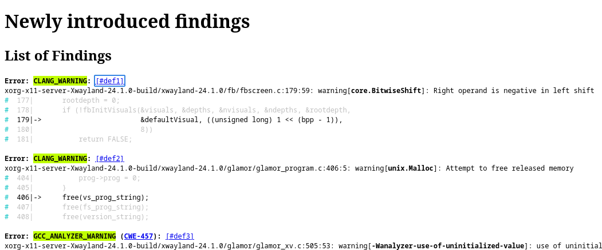

We are excited to announce a new experimental feature in our service: the integration of Static
Application Security Testing (SAST) using [OpenScanHub](https://openscanhub.fedoraproject.org/).

OpenScanHub is a service that runs various static analyzers on RPM packages - by default `Cppcheck`,
`ShellCheck` and the static analyzers embedded in `GCC`.

Let's have a look at the details of the prototype!

<!--truncate-->

## Why

This initiative contributes to the _shift left_ effort, aiming to detect and address security
vulnerabilities earlier in the development process, thus enhancing overall software quality
and security. By implementing this scanning functionality for `fedora-rawhide`, the current
development version of Fedora, we aim to catch security issues at the earliest possible stage.
This is also important as Fedora serves as an upstream platform for downstream distributions
like RHEL, ensuring that any vulnerabilities are addressed before they propagate to these other systems.

## Functionality

The functionality is designed to automatically
scan for vulnerabilities and issues in code submitted through pull requests.
It is controlled using the configuration option
[`osh_diff_scan_after_copr_build`](/docs/configuration#osh_diff_scan_after_copr_build),
which is currently set to `true` by default.
However, even with this option enabled, the differential scanning feature in OpenScanHub
will only run for users who have also configured Copr builds with the `trigger: commit`
setting and have matching target branches in their pull request and job configurations.
This setup is crucial as it allows Packit to access the base build necessary for differential
scanning, leading to more precise detection of issues introduced by the pull request.

## Setup

To utilise this feature, you must ensure that Copr builds for commits are configured,
along with Copr builds for pull requests, both set to run for `fedora-rawhide-x86_64`.
If you haven't enabled Copr builds for commits yet, you can add the following job
configuration to the `jobs` section in your Packit configuration:

```yaml
- job: copr_build
  trigger: commit
  branch: main
  targets:
    - fedora-rawhide
  preserve_project: true
```

This configuration assumes that you merge your pull requests into the `main` branch
and ensures preserving the Copr project (as opposed to creating a temporary one,
see more details [here](https://packit.dev/docs/configuration/upstream/copr_build#optional-parameters)).
You can also build in your custom Copr project (more details
[here](https://packit.dev/docs/configuration/upstream/copr_build#using-a-custom-copr-project)).

Here is an example of a scan showing some new findings:



:::tip

Besides this newly introduced integration with Packit Service, you can also submit scans locally using Packit CLI,
see more details in [docs](/docs/cli/scan-in-osh).

:::

## Conclusion

As this is an initial prototype, the configuration and functionality may evolve based on user feedback
(e.g. reporting the actual results of a scan).
We invite you to try out this feature and [share your thoughts](https://github.com/packit/packit/discussions/2371) with us
(e.g. if you would benefit from other `osh-cli` options to be included).
For more information on setting up this feature, see the [info above](#setup).

:::tip

A small update. Default configurations for the static analyzers like `cppcheck` can now be tweaked through [`--csmock-args` CLI option](/docs/cli/scan-in-osh) or [a `csmock_args` option](/docs/configuration#csmock_args) in the Packit's config file. For instance, you can specify arguments like `--cppcheck-add-flag=--enable=style` to check styling issues as seen in [this example run](https://openscanhub.fedoraproject.org/task/10066/) triggered from [this](https://github.com/avahi/avahi/pull/641) testing pull-request on Avahi.

:::
